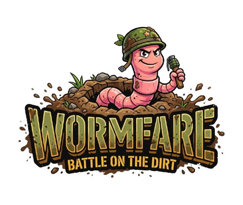

  

  # Wormfare: Battle on the Dirt
  
  *The garden wasn't big enough for both of us.*

  
  
  
  

---

## About The Game
Wormfare is a real-time, multiplayer, grid-based tactical game inspired by classic Battleship. You command an elite slither-squad of earthworms, place them strategically in your garden, and take turns firing blindly at the enemy's soil until one army is completely wiped out!

  
  
  

## Features
- Real-Time Multiplayer: Engage in live 1v1 tactical mud-fights using WebSockets.
- Drag & Drop Deployment: Intuitively position and rotate your troops before the battle begins.
- Dynamic Coach: A helpful Coach Worm guides you through the heat of battle with contextual dialogues.
- Global Leaderboards: Earn ELO points and see who is truly the conqueror of the soil.
- Custom Artwork: Vibrant modern UI, fun animations, and plenty of dirt.

## Tech Stack
- Frontend: React, Vite, Tailwind CSS, Zustand, React-DnD
- Backend: Go, Gin Framework, Gorilla WebSockets
- Database: Supabase (PostgreSQL) + Prisma ORM
- Deployment: Vercel (Frontend), Render (Backend)

## License
Distributed under the MIT License. See LICENSE for more information.
